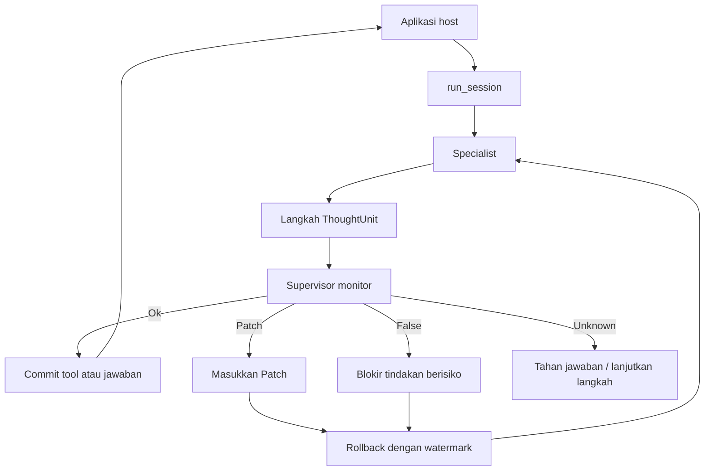

# InterrupThink

*Interruptible Reasoning at Thought Units* (IRTU)

[English](README.md) · [Bahasa Indonesia](README.id.md)

Supervisor dapat **menginterupsi** specialist pada batas `ThoughtUnit` dan
**mengoreksi** proses penalarannya—bukan sekadar membatalkan proses, dan bukan
pula pada batas token mentah.

InterrupThink adalah library eksperimental, bukan produk atau layanan hosted.

[Mulai cepat](docs/id/getting-started.md) · [Examples](examples/) · [Cases](cases/) · [Contributing](CONTRIBUTING.md) · [Lisensi](LICENSE)

Mulai dari [`Mulai cepat`](docs/id/getting-started.md). Peta lengkap
dokumentasi tersedia di [`docs/`](docs/) dan
[dokumentasi Bahasa Indonesia](docs/id/README.md).

## Tentang InterrupThink

InterrupThink adalah library Python open-source dengan thinking floor yang
sederhana. Specialist menghasilkan langkah yang dapat diperiksa, lalu
supervisor meninjaunya. Hanya output dengan watermark yang boleh di-commit.

Interupsi tidak selalu mengakhiri sesi. Secara default, sistem memakai
**rollback**: sisipkan koreksi, buang bagian yang salah, lalu lanjutkan dari
langkah terakhir yang diterima. Restart penuh hanya menjadi pilihan terakhir.

- Import: `interrupthink`
- Nama distribusi: `interrupthink` (wheel lokal atau editable install)
- Batas interupsi: `ThoughtUnit` (`<step>`), bukan hidden chain-of-thought
- Default monitor: `Unknown` (jangan menginterupsi tanpa bukti)
- Bukan UI, mesh multi-agent, atau paket khusus framework

## Komponen utama

| Komponen | Peran |
|----------|-------|
| `ThoughtUnit` | Satu langkah yang dapat diperiksa dari dokumen specialist |
| `run_session` | Thinking floor: specialist bekerja, monitor mengamati, dan tool hanya berjalan jika diizinkan |
| `LlmMonitor` / `ScriptedMonitor` | Memeriksa setiap `ThoughtUnit` sesuai kebutuhan secara blocking; default `Unknown` |
| `Patch` / `False` | Menghentikan jalur yang salah atau memasukkan koreksi |
| `rollback` | Melanjutkan dari checkpoint, bukan mengulang dari awal |

Floor ini dirakit oleh aplikasi host. Tidak ada helper “produk” yang wajib
digunakan.

## Cara kerja

Aplikasi host tetap memiliki graph, role, dan tool-nya sendiri. Thinking floor
dijalankan oleh `run_session`: specialist menghasilkan langkah `ThoughtUnit`,
supervisor memantau langkah tersebut, dan tool atau jawaban hanya di-commit
setelah diizinkan. Jalur yang salah dapat diblokir atau dikoreksi, lalu
dilanjutkan dengan rollback.



## Mulai cepat

Membutuhkan Python 3.11 atau lebih baru. Contoh deterministik tidak
membutuhkan API key.

```bash
uv pip install -e .
python3 examples/run_session_dummy.py
```

```python
from interrupthink import DummyTool, FakeLlm, ScriptedMonitor, run_session

tool = DummyTool()
llm = FakeLlm([wrong_xml, stopped_xml])
monitor = ScriptedMonitor(trigger_kind="premise", trigger_contains="already approved")
result = run_session(llm=llm, monitor=monitor, tool=tool)
# result.committed_answer, interrupt_ids, dropped_ids, request_count, tool_calls
```

Setelah interupsi, `FakeLlm` harus menyediakan dokumen XML kedua. `run_session`
tidak menambahkan prompt khusus aplikasi ke request.

## Contoh dan integrasi

Contoh pendek ada di [`examples/`](examples/). Use-case yang lebih lengkap ada
di [`cases/`](cases/).

Framework host seperti LangGraph, LangChain, LlamaIndex, CrewAI, dan AutoGen
bersifat opsional. Framework tersebut menyediakan struktur aplikasi, sedangkan
thinking floor tetap menggunakan `run_session`.

| Host | Cookbook | Peran `run_session` |
|------|----------|---------------------|
| Native | [`cases/two-specialists/`](cases/two-specialists/) | Dua sesi specialist |
| LangGraph | [`cases/langgraph-pipe/`](cases/langgraph-pipe/) | Satu atau dua node |
| LangChain | [`cases/langchain-specialist/`](cases/langchain-specialist/) | Floor di sekitar framework |
| LlamaIndex | [`cases/llamaindex-retrieve/`](cases/llamaindex-retrieve/) | Retrieval tetap di framework |
| CrewAI | [`cases/crewai-pipe/`](cases/crewai-pipe/) | Floor di setiap role |
| AutoGen | [`cases/autogen-pipe/`](cases/autogen-pipe/) | Floor di setiap agent |

CLI live menggunakan `LiveOpenAILlm` dan `LlmMonitor` dengan `.env` pribadi.
Jangan commit kredensial.

## Pengembangan

Lihat [`CONTRIBUTING.md`](CONTRIBUTING.md), bukti di [`docs/results.md`](docs/results.md),
dan dokumentasi Bahasa Indonesia di [`docs/id/`](docs/id/).

```bash
uv pip install -e ".[dev]"
python3 -m pytest tests/test_public_api.py tests/test_library_packaging.py -x --tb=short -q
```

Library ini masih eksperimental. Klaim publik dibatasi pada pemeriksaan yang
dijelaskan di dokumentasi hasil.

## Lisensi

Hak cipta 2026 BillyBSig. Dilisensikan di bawah
[Apache License, Version 2.0](LICENSE).
