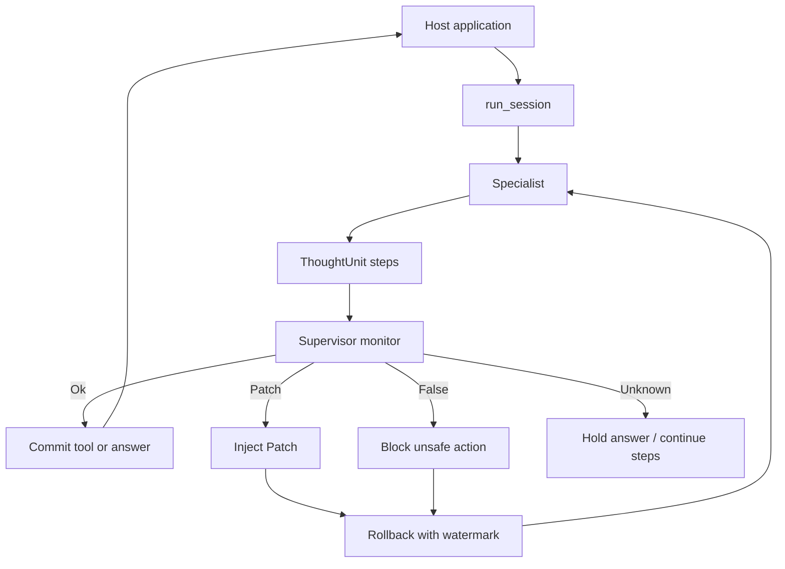

# InterrupThink

*Interruptible Reasoning at Thought Units* (IRTU)

[English](README.md) · [Bahasa Indonesia](README.id.md)

A supervisor can **interrupt** a specialist at **ThoughtUnit** boundaries and **correct** the reasoning path — not only cancel it, and not at raw tokens.

This is an experimental library, not a product or a hosted service.

[Getting started](docs/getting-started.md) · [Examples](examples/) · [Cases](cases/) · [Concepts](docs/concepts.md) · [Contributing](CONTRIBUTING.md) · [License](LICENSE)

## Quickstart

Needs Python 3.11+. A live run calls an OpenAI Responses-compatible endpoint.
Copy `.env.example` to `.env` and fill the model, base URL, and key.

```bash
cp .env.example .env
uv pip install -e .
python3 cases/freeze-write/run.py
```

```python
from interrupthink import LiveLlm, LlmMonitor, run_session

result = run_session(
    llm=LiveLlm(user_prompt="Check the claim, then answer."),
    monitor=LlmMonitor(),
)
# result.committed_answer, interrupt_ids, dropped_ids, request_count, tool_calls
```

`LiveLlm` reads `LLM_MODEL`, `LLM_BASE_URL`, and `LLM_API_KEY` (or
`OPENAI_API_KEY`). The default base URL is `https://api.openai.com/v1`.
Point `LLM_BASE_URL` at another endpoint that accepts the same request
shape. `LlmMonitor` reads the `SUPERVISOR_*` variables.

### Without a key

The same floor accepts a scripted specialist. This path needs no API key
and returns the same result on every run.

```bash
python3 examples/run_session_dummy.py
```

```python
from interrupthink import DummyTool, FakeLlm, ScriptedMonitor, run_session

tool = DummyTool()
llm = FakeLlm([wrong_xml, stopped_xml])
monitor = ScriptedMonitor(trigger_kind="premise", trigger_contains="already approved")
result = run_session(llm=llm, monitor=monitor, tool=tool)
```

Host policy is a separate check. [`examples/tool_policy_deny.py`](examples/tool_policy_deny.py) refuses `publish` after the monitor returns `Ok`.

After an interrupt, `FakeLlm` must supply a second XML document or the session reports an error. `run_session` does not add application-specific prompts to the request.

Local wheel (still **not** PyPI):

```bash
uv build --wheel
uv pip install --offline --no-index dist/interrupthink-0.0.1-py3-none-any.whl
```

## How it works

The host application keeps its own graph, roles, or tools. The thinking floor
is `run_session`: the specialist emits checkable `ThoughtUnit` steps, the
supervisor monitors those steps, and a tool or answer is committed only when
allowed. A cut can **block** an unsafe action **and correct** the path, then
resume with rollback instead of restarting from scratch.

The default after a cut is **rollback**: inject a correction, drop the invalid tail, and continue from the last accepted step. A full restart is the fallback. The monitor default is `Unknown` (do not cut). Import the package as `interrupthink`.



| Piece | Role |
|-------|------|
| `ThoughtUnit` | One checkable step in the specialist's document |
| `run_session` | Thinking floor: the specialist works, the monitor observes, and tools run only if allowed |
| `LlmMonitor` / `ScriptedMonitor` | On-demand blocking verdict per `ThoughtUnit`; default `Unknown` |
| `Patch` / `False` | Interrupt: block a bad path, or inject a correction |
| rollback | Resume mid-stream from a checkpoint — not restart from scratch |
| `Escalation` | Package for the next specialist. The first specialist does not resume |
| `Consult` | Package for the checker. A `Patch` returns to the same specialist |
| `Takeover` | Package for an editor or a human. A human does not start a second specialist |

Wire the floor yourself. There is no canned product helper required for the public path.

An `Ok` verdict can also name a receiver. `Unknown` and a blank name do not.
`Escalation`, `Consult`, and `Takeover` compose the package. They do not call
`run_session`. The host opens the next session only when the name is present.
The package keeps the original task, the receiver, the supervisor reason, the
kept steps, recorded tool results, and the calls that must not be repeated.
The unfinished answer is not committed.

More detail: [`docs/concepts.md`](docs/concepts.md).

### Escalation

The next specialist receives the package. The first specialist does not resume.

```python
from interrupthink import Escalation, ScriptedMonitor, run_session

result = run_session(
    llm=dealer,
    monitor=ScriptedMonitor(
        trigger_kind="claim",
        trigger_contains="ask policy",
        escalate_to="policy",
    ),
)
if result.escalate_to:
    package = Escalation.from_result(task, result)
    # Pass package.text() into a new run_session for the policy specialist.
```

Call site: [`examples/supervisor_escalation.py`](examples/supervisor_escalation.py).
Live demo: [`examples/langgraph_offer_escalation.py`](examples/langgraph_offer_escalation.py).
Cookbook: [`cases/langgraph-offer/`](cases/langgraph-offer/).

### Consultation

The checker reads the package. The checker's answer comes back to the same specialist as a `Patch`.

```python
from interrupthink import Consult, Patch, ScriptedMonitor, run_session

result = run_session(
    llm=assistant,
    monitor=ScriptedMonitor(
        trigger_kind="claim",
        trigger_contains="ask the checker",
        consult_to="checker",
    ),
)
if result.consult_to:
    package = Consult.from_result(task, result)
    checker = run_session(llm=checker_llm, monitor=monitor)
    note = next(event.payload for event in result.events if event.type == "floor.consult")
    answer = checker.committed_answer or ""
    patch = Patch(
        from_agent="A",
        target_unit_id=str(note["unit_id"]),
        rollback_to=None,
        diagnosis="consult",
        missing=answer,
        directive=answer,
    )
    continued = run_session(llm=assistant, monitor=monitor, resume_patch=patch)
```

`checker_llm` should see `package.text()`. `assistant` is the same specialist as the first session.

Call site: [`examples/supervisor_consult.py`](examples/supervisor_consult.py).
Live demos: [`examples/langchain_rule_consult.py`](examples/langchain_rule_consult.py),
[`examples/llamaindex_page_consult.py`](examples/llamaindex_page_consult.py).
Cookbooks: [`cases/langchain-rule/`](cases/langchain-rule/),
[`cases/llamaindex-page/`](cases/llamaindex-page/).

### Takeover

`editor` is another specialist and may receive a new `run_session`. `human` is not: return the package and do not start a second specialist.

```python
from interrupthink import ScriptedMonitor, Takeover, run_session

result = run_session(
    llm=support,
    monitor=ScriptedMonitor(
        trigger_kind="claim",
        trigger_contains="the supervisor should take this",
        takeover_to="human",
    ),
)
if result.takeover_to == "human":
    package = Takeover.from_result(task, result)
    # Return package.text() to the person. Do not open another run_session.
```

Call site: [`examples/supervisor_takeover.py`](examples/supervisor_takeover.py).
Live demo: [`examples/autogen_support_takeover.py`](examples/autogen_support_takeover.py).
Editor shape: [`examples/database_takeover.py`](examples/database_takeover.py).
Cookbook: [`cases/autogen-support/`](cases/autogen-support/).

## Examples

Short call sites after `pip install -e .`. Full stories live in [`cases/`](cases/).

| File | Calls |
|------|--------|
| [`examples/run_session_dummy.py`](examples/run_session_dummy.py) | `run_session` |
| [`examples/staging_migrate.py`](examples/staging_migrate.py) | canned staging-migrate example (local helper) |
| [`examples/freeze_push_dummy.py`](examples/freeze_push_dummy.py) | freeze + dummy `push` |
| [`examples/host_loop_dummy.py`](examples/host_loop_dummy.py) | host loop; HITL at the tool boundary |
| [`examples/tool_policy_deny.py`](examples/tool_policy_deny.py) | host denies `publish` after monitor `Ok` |
| [`examples/supervisor_escalation.py`](examples/supervisor_escalation.py) | `Escalation`: next specialist receives the package |
| [`examples/supervisor_consult.py`](examples/supervisor_consult.py) | `Consult`: patch returns to the same specialist |
| [`examples/supervisor_takeover.py`](examples/supervisor_takeover.py) | `Takeover`: editor or human receives the package |
| [`examples/langgraph_offer_escalation.py`](examples/langgraph_offer_escalation.py) | LangGraph escalation |
| [`examples/langchain_rule_consult.py`](examples/langchain_rule_consult.py) | LangChain consultation |
| [`examples/crewai_order_escalation.py`](examples/crewai_order_escalation.py) | CrewAI escalation |
| [`examples/autogen_support_takeover.py`](examples/autogen_support_takeover.py) | AutoGen takeover to a human |
| [`examples/llamaindex_page_consult.py`](examples/llamaindex_page_consult.py) | LlamaIndex consultation |

Framework demos install the framework in the venv with `pip`, not as a core dependency. The full list is [`examples/README.md`](examples/README.md).

Case runners use `LiveLlm` and `LlmMonitor` with a personal `.env`. Do not commit keys. Dummy `examples/*_dummy.py` files stay scripted.

## Integrations

The host framework provides application structure, not the semantic thinking loop. Each specialist slot still calls `run_session`. Optional integrations are installed separately and skipped safely when unavailable.

| Host | Cookbook | Think slot |
|------|----------|------------|
| Native | [`cases/two-specialists/`](cases/two-specialists/) | two `run_session` |
| LangGraph | [`cases/langgraph-pipe/`](cases/langgraph-pipe/) | one node or two nodes, each `run_session` |
| LangChain | [`cases/langchain-specialist/`](cases/langchain-specialist/) | keep the thinking floor around the framework |
| LlamaIndex | [`cases/llamaindex-retrieve/`](cases/llamaindex-retrieve/) | use the retriever for retrieval |
| CrewAI | [`cases/crewai-pipe/`](cases/crewai-pipe/) | keep `run_session` inside each role |
| AutoGen | [`cases/autogen-pipe/`](cases/autogen-pipe/) | keep `run_session` inside each agent |

Named handoffs use the same floor. The framework keeps its nodes, roles, or index. The host composes the package and opens the next step.

| Route | Host | Cookbook | Demo |
|-------|------|----------|------|
| Escalation | LangGraph | [`cases/langgraph-offer/`](cases/langgraph-offer/) | [`examples/langgraph_offer_escalation.py`](examples/langgraph_offer_escalation.py) |
| Consultation | LangChain | [`cases/langchain-rule/`](cases/langchain-rule/) | [`examples/langchain_rule_consult.py`](examples/langchain_rule_consult.py) |
| Escalation | CrewAI | [`cases/crewai-order/`](cases/crewai-order/) | [`examples/crewai_order_escalation.py`](examples/crewai_order_escalation.py) |
| Takeover to `human` | AutoGen | [`cases/autogen-support/`](cases/autogen-support/) | [`examples/autogen_support_takeover.py`](examples/autogen_support_takeover.py) |
| Consultation | LlamaIndex | [`cases/llamaindex-page/`](cases/llamaindex-page/) | [`examples/llamaindex_page_consult.py`](examples/llamaindex_page_consult.py) |

## Development

See [`CONTRIBUTING.md`](CONTRIBUTING.md). Evidence, limitations, and how to
extend the public docs: [`docs/`](docs/).

```bash
uv pip install -e ".[dev]"
python3 -m pytest tests/test_public_api.py tests/test_library_packaging.py -x --tb=short -q
```

The library is experimental. It is not a product or a
multi-agent mesh. Public claims are limited to the checks in
[`docs/results.md`](docs/results.md).

## License

Copyright 2026 BillyBSig. Licensed under the
[Apache License, Version 2.0](LICENSE).
