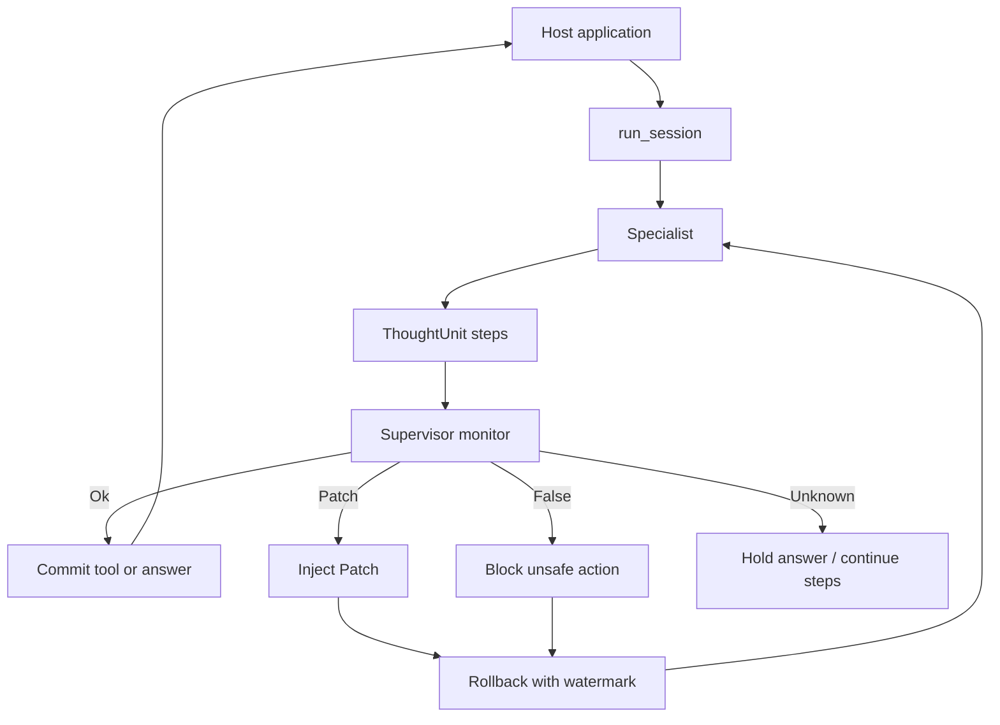

# InterrupThink

*Interruptible Reasoning at Thought Units* (IRTU)

[English](README.md) · [Bahasa Indonesia](README.id.md)

A supervisor can **interrupt** a specialist at **ThoughtUnit** boundaries and **correct** the reasoning path — not only cancel it, and not at raw tokens.

This is an experimental library, not a product or a hosted service.

[Getting started](docs/getting-started.md) · [Examples](examples/) · [Cases](cases/) · [Contributing](CONTRIBUTING.md) · [License](LICENSE)

Start here: [`Getting started`](docs/getting-started.md). For the full map,
see [`docs/`](docs/).

## About

InterrupThink is an open-source Python library with a simple thinking floor.
A specialist streams checkable steps, and a supervisor may issue a verdict
after each complete ThoughtUnit. Only watermarked output is committed.

An interruption does not necessarily end the session. The default is
**rollback**: inject a correction, drop the invalid tail, and continue from
the last accepted step. A full restart is the fallback, not the default.

- Import: `interrupthink`
- Distribution name: `interrupthink` (local wheel or editable install; **not** PyPI)
- Interrupt unit: `ThoughtUnit` (`<step>`), not hidden chain-of-thought
- Monitor default: `Unknown` (do not cut)
- This is not a UI, a multi-agent mesh, or a framework-specific package such as `interrupthink-langgraph`

## Building blocks

| Piece | Role |
|-------|------|
| `ThoughtUnit` | One checkable step in the specialist's document |
| `run_session` | Thinking floor: the specialist works, the monitor observes, and tools run only if allowed |
| `LlmMonitor` / `ScriptedMonitor` | On-demand blocking verdict per `ThoughtUnit`; default `Unknown` |
| `Patch` / `False` | Interrupt: block a bad path, or inject a correction |
| rollback | Resume mid-stream from a checkpoint — not restart from scratch |

Wire the floor yourself. There is no canned “product” helper required for the public path.

## How it works

The host application keeps its own graph, roles, or tools. The thinking floor
is `run_session`: the specialist emits checkable `ThoughtUnit` steps, the
supervisor monitors those steps, and a tool or answer is committed only when
allowed. A cut can **block** an unsafe action **and correct** the path, then
resume with rollback instead of restarting from scratch.



More detail: [`docs/concepts.md`](docs/concepts.md).

## Quickstart

Needs Python 3.11+. A live run calls an OpenAI Responses-compatible endpoint.
Copy `.env.example` to `.env` and fill the model, base URL, and key.

```bash
cp .env.example .env
uv pip install -e .
python3 cases/freeze-write/run.py
```

```python
from interrupthink import LiveLlm, LlmMonitor, run_session

result = run_session(
    llm=LiveLlm(user_prompt="Check the claim, then answer."),
    monitor=LlmMonitor(),
)
# result.committed_answer, interrupt_ids, dropped_ids, request_count, tool_calls
```

`LiveLlm` reads `LLM_MODEL`, `LLM_BASE_URL`, and `LLM_API_KEY` (or
`OPENAI_API_KEY`). The default base URL is `https://api.openai.com/v1`.
Point `LLM_BASE_URL` at another endpoint that accepts the same request
shape. `LlmMonitor` reads the `SUPERVISOR_*` variables.

### Without a key

The same floor accepts a scripted specialist. This path needs no API key
and returns the same result on every run.

```bash
python3 examples/run_session_dummy.py
```

```python
from interrupthink import DummyTool, FakeLlm, ScriptedMonitor, run_session

tool = DummyTool()
llm = FakeLlm([wrong_xml, stopped_xml])
monitor = ScriptedMonitor(trigger_kind="premise", trigger_contains="already approved")
result = run_session(llm=llm, monitor=monitor, tool=tool)
```

After an interrupt, `FakeLlm` must supply a second XML document or the session reports an error. `run_session` does not add application-specific prompts to the request.

Local wheel (still **not** PyPI):

```bash
uv build --wheel
uv pip install --offline --no-index dist/interrupthink-0.0.1-py3-none-any.whl
```

## Examples

Short call sites after `pip install -e .`. Not full use-case cookbooks — those live in [`cases/`](cases/).

| File | Calls |
|------|--------|
| [`examples/run_session_dummy.py`](examples/run_session_dummy.py) | `run_session` |
| [`examples/staging_migrate.py`](examples/staging_migrate.py) | canned staging-migrate example (local helper) |
| [`examples/freeze_push_dummy.py`](examples/freeze_push_dummy.py) | freeze + dummy `push` |
| [`examples/host_loop_dummy.py`](examples/host_loop_dummy.py) | host loop; HITL at the tool boundary |

Framework demos (install the framework in the venv with `pip`): LangGraph, LangChain, LlamaIndex, CrewAI, and AutoGen — see [`examples/README.md`](examples/README.md).

Case runners use `LiveLlm` and `LlmMonitor` with a personal `.env`. Do not commit keys. Dummy `examples/*_dummy.py` files stay scripted.

## Integrations

The host framework provides application structure, not the semantic thinking loop. Each specialist slot still calls `run_session`. Optional integrations are installed separately and skipped safely when unavailable.

| Host | Cookbook | Think slot |
|------|----------|------------|
| Native | [`cases/two-specialists/`](cases/two-specialists/) | two `run_session` |
| LangGraph | [`cases/langgraph-pipe/`](cases/langgraph-pipe/) | one node or two nodes, each `run_session` |
| LangChain | [`cases/langchain-specialist/`](cases/langchain-specialist/) | keep the thinking floor around the framework |
| LlamaIndex | [`cases/llamaindex-retrieve/`](cases/llamaindex-retrieve/) | use the retriever for retrieval |
| CrewAI | [`cases/crewai-pipe/`](cases/crewai-pipe/) | keep `run_session` inside each role |
| AutoGen | [`cases/autogen-pipe/`](cases/autogen-pipe/) | keep `run_session` inside each agent |

## Development

See [`CONTRIBUTING.md`](CONTRIBUTING.md). Evidence, limitations, and how to
extend the public docs: [`docs/`](docs/).

```bash
uv pip install -e ".[dev]"
python3 -m pytest tests/test_public_api.py tests/test_library_packaging.py -x --tb=short -q
```

The library is experimental. It is not a product or a
multi-agent mesh. Public claims are limited to the checks in
[`docs/results.md`](docs/results.md).

## License

Copyright 2026 BillyBSig. Licensed under the
[Apache License, Version 2.0](LICENSE).
