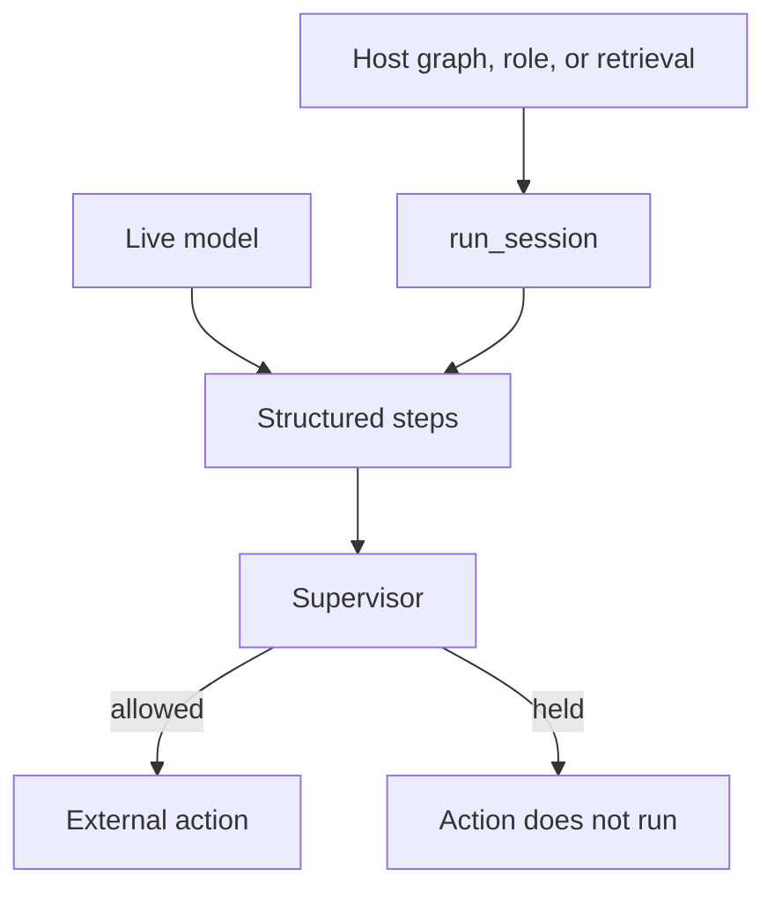

# Use-case cookbooks

Each folder is a small, runnable story showing how an application can use
InterrupThink. The stories use ordinary examples such as files, support
messages, and policy documents so that the important behavior is easy to see.

In a typical run, a live language model produces structured steps and a
supervisor checks those steps before an external action is allowed. The command
line examples use `LiveOpenAILm` and `LlmMonitor` with credentials from a
personal `.env` file. The tests use deterministic substitutes so that they are
repeatable and do not need an API key.

The framework folders show how to keep `run_session` at the semantic thinking
boundary while the host framework continues to manage its own nodes, roles,
tools, or retrieval. The framework packages are optional.

Some stories name a receiver. Escalation gives the kept work to the next
specialist. Consultation returns a patch to the same specialist. Takeover
gives the package to an editor or a human. The host opens that next step.
`Escalation`, `Consult`, and `Takeover` only compose the text.

| Folder | What it demonstrates |
|--------|----------------------|
| [`freeze-write/`](freeze-write/) | Check a release-freeze claim before writing a file |
| [`two-specialists/`](two-specialists/) | Pass reviewed information from one specialist to a second specialist |
| [`stale-retrieve/`](stale-retrieve/) | Prevent an outdated retrieved document from driving an action |
| [`false-policy/`](false-policy/) | Stop an unsupported policy statement before it reaches an outbox |
| [`op-class/`](op-class/) | Treat a read as safer than an irreversible delete |
| [`correct-resume/`](correct-resume/) | Correct a wrong host claim and continue with the corrected fact |
| [`deny-answer-pipeline/`](deny-answer-pipeline/) | Let a message sender run only after an earlier answer is accepted |
| [`langgraph-node/`](langgraph-node/) | Put the thinking floor inside one LangGraph node |
| [`langgraph-apply/`](langgraph-apply/) | Add the floor while keeping an existing LangGraph tool node |
| [`langgraph-correct/`](langgraph-correct/) | Correct a host claim and continue through a LangGraph tool node |
| [`langgraph-pipe/`](langgraph-pipe/) | Connect two LangGraph specialists with a reviewed handoff |
| [`langgraph-offer/`](langgraph-offer/) | Run the offer package through the demo's two LangGraph nodes |
| [`langchain-specialist/`](langchain-specialist/) | Use LangChain for prompts and tools around a protected write |
| [`langchain-correct/`](langchain-correct/) | Correct a host claim in a LangChain integration |
| [`langchain-chat/`](langchain-chat/) | Check a claim during a two-turn LangChain conversation |
| [`langchain-rule/`](langchain-rule/) | Continue the same LangChain chat after a rule check |
| [`llamaindex-retrieve/`](llamaindex-retrieve/) | Retrieve with LlamaIndex, then let the floor govern the next step |
| [`llamaindex-page/`](llamaindex-page/) | Continue the same assistant only as far as one retrieved page |
| [`crewai-pipe/`](crewai-pipe/) | Connect two sequential CrewAI roles with a reviewed handoff |
| [`crewai-order/`](crewai-order/) | Give the counter role the order package without placing the wrong order |
| [`crewai-correct/`](crewai-correct/) | Correct a host claim in a single CrewAI role |
| [`autogen-pipe/`](autogen-pipe/) | Connect two AutoGen agents with a reviewed handoff |
| [`autogen-support/`](autogen-support/) | Hand a support chat to a human without a second agent |
| [`autogen-correct/`](autogen-correct/) | Correct a host claim in a single AutoGen agent |

The short files in [`examples/`](../examples/) show API call patterns. The
folders here add a complete story, local input/output paths, and a runnable
command.
