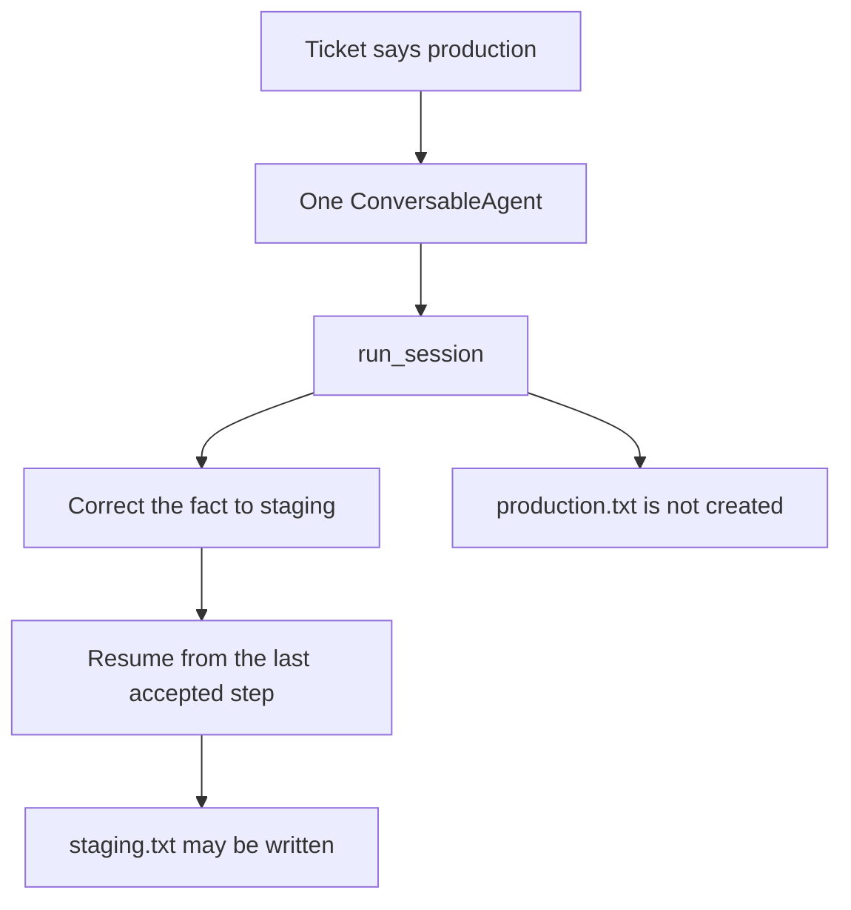

# Correct a wrong host claim in AutoGen

This example uses one AutoGen `ConversableAgent` to work on a deployment
ticket. The ticket incorrectly identifies the target as production. The
agent's thinking step calls `run_session`, allowing the supervisor to catch the
mistake before the file tool runs.

The supervisor supplies the corrected staging fact. The session rolls back to
the last accepted step and continues, so `production.txt` is never created and
the corrected path may write `staging.txt`.



```python
from graph import run_autogen_correct

out = run_autogen_correct(interrupt=True, sandbox=Path("tmp"))
```

```bash
pip install autogen   # venv, not uv add
python3 cases/autogen-correct/run.py
```

Demo: `examples/autogen_correct.py`.
