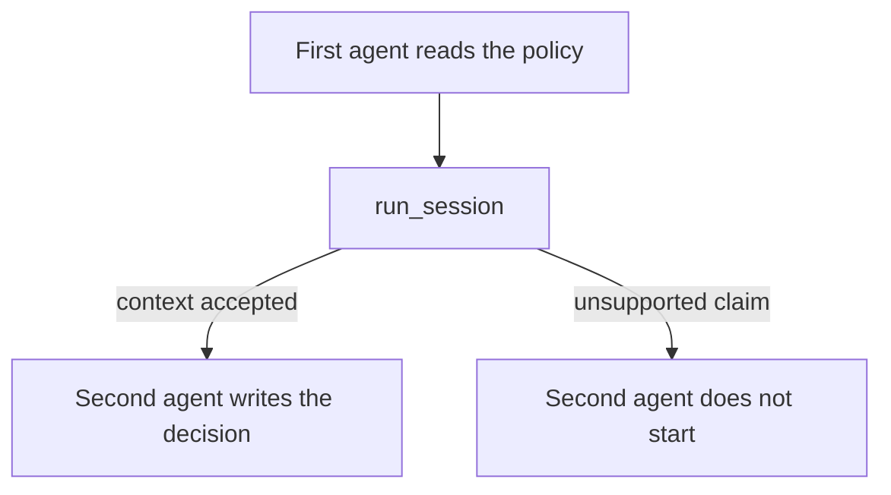

# Passing reviewed information through AutoGen

This example uses two AutoGen `ConversableAgent` instances in a one-way
workflow. The first agent reads a refund policy and prepares context. The
second agent creates a sandbox decision only after that context is accepted.
Each agent's thinking step calls `run_session`.

If the first agent makes an unsupported claim, the host does not start the
second agent. The example uses AutoGen for agent configuration and messaging;
InterrupThink remains responsible for checking semantic steps.



The policy fixtures are shared with `cases/two-specialists/`. This is an
integration example, not a separate InterrupThink package.

```bash
pip install autogen    # venv, not uv add
python3 cases/autogen-pipe/run.py
```

Demo: `examples/autogen_two_specialists.py`.
