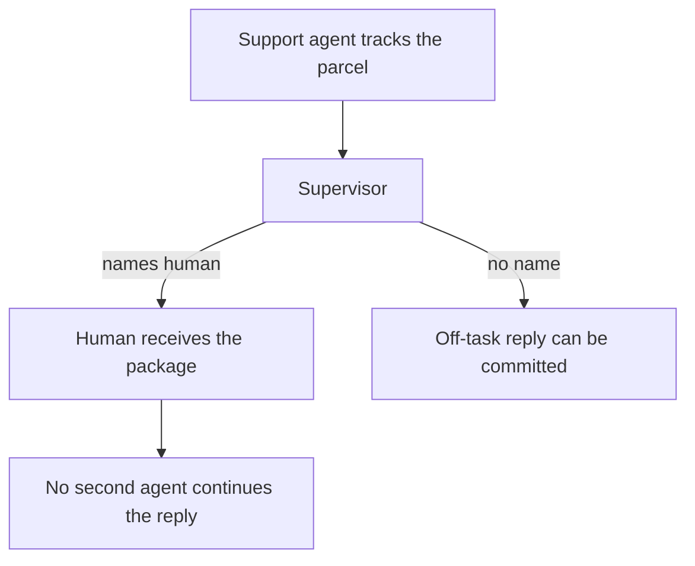

# Support package for a human

The support agent tracks a parcel. The supervisor names human before an
off-task reply is committed. No second agent continues that reply. The route
lives in this folder.



```bash
pip install autogen    # venv, not uv add
python3 cases/autogen-support/run.py
```

Demo: `examples/autogen_support_takeover.py`.
