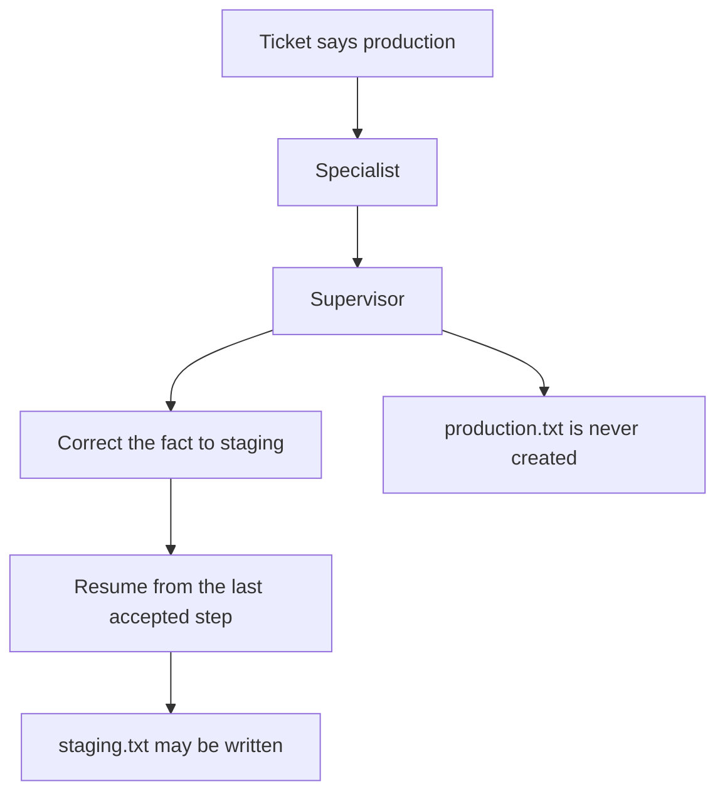

# Correct a wrong fact and continue

Imagine a deployment ticket that incorrectly says the target host is
production. The specialist begins to act on that claim. The supervisor
interrupts the attempt, supplies the corrected fact that the host is staging,
and lets the specialist continue from the last accepted step.

The invalid `production.txt` file is never created. After the correction,
`staging.txt` may be written. The session resumes with rollback rather than
starting the whole task again.



The command-line run uses `LiveLlm` and `LlmMonitor`. The tests use
deterministic substitutes so they can run without credentials.

```bash
uv pip install -e .
python3 cases/correct-resume/run.py   # personal .env
```
