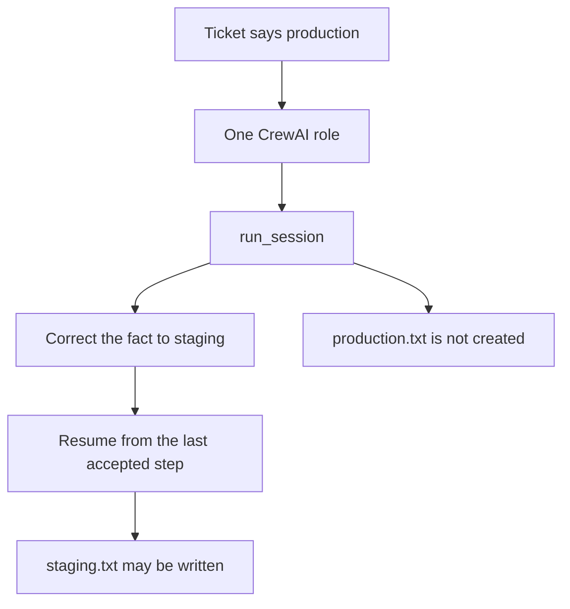

# Correct a wrong host claim in CrewAI

This example uses one CrewAI role with an `Agent` and a `Task`. The role works
on a deployment ticket that incorrectly identifies the target as production.
Its thinking step calls `run_session`, so the supervisor can check the claim
before the file tool runs.

When the claim is corrected to staging, the session rolls back to the last
accepted step and continues. The invalid `production.txt` file is not created;
the corrected path may write `staging.txt`.



```python
from graph import run_crewai_correct

out = run_crewai_correct(interrupt=True, sandbox=Path("tmp"))
```

```bash
pip install crewai   # venv, not uv add
python3 cases/crewai-correct/run.py
```

Demo: `examples/crewai_correct.py`.
