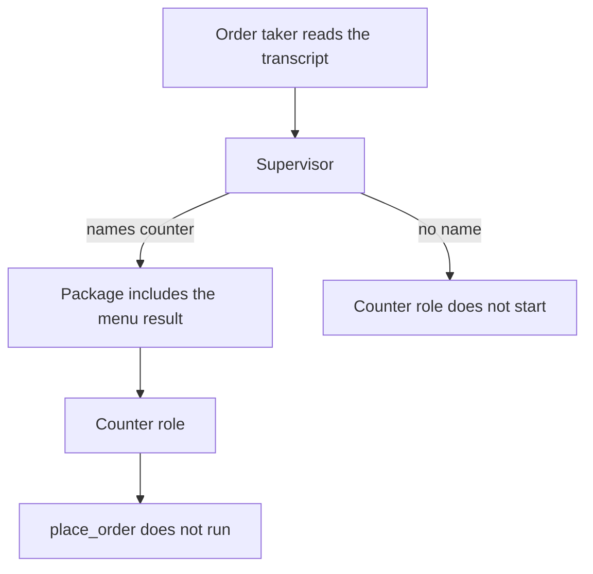

# Order package for the counter role

The order taker reads a written transcript. The supervisor names counter
before a mismatched order is committed. The counter role receives that
package, and `place_order` does not run. The route lives in this folder.



```bash
pip install crewai    # venv, not uv add
python3 cases/crewai-order/run.py
```

Demo: `examples/crewai_order_escalation.py`.
