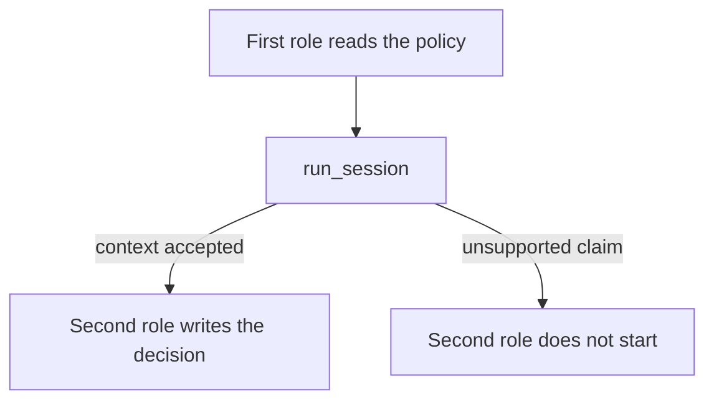

# Passing reviewed information through CrewAI

This example uses two CrewAI roles in sequence. The first role reads a refund
policy and prepares context. The second role turns accepted context into a
decision in the sandbox. Each role calls `run_session`, while CrewAI manages
the order in which the roles are invoked.

If the first role makes an unsupported claim, the second role is not started.
This keeps the example's handoff clear and avoids treating the whole crew as a
replacement for the semantic thinking floor.



The policy fixtures are shared with `cases/two-specialists/`. This is an
integration example, not a separate InterrupThink package.

```bash
pip install crewai    # venv, not uv add
python3 cases/crewai-pipe/run.py
```

Demo: `examples/crewai_two_specialists.py`.
