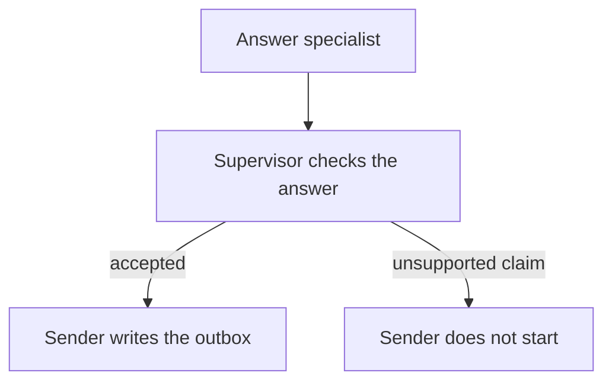

# Check an answer before sending it

This example separates drafting from delivery. One specialist prepares an
answer for a customer, and a second specialist turns the accepted answer into
an outbox message. If the first answer contains an unsupported claim, the
second step is never started.

The outbox is a local sandbox, not an SMTP server. An optional LangGraph host
shows that the same handoff can be represented in a framework graph.



```bash
uv pip install -e .
python3 cases/deny-answer-pipeline/run.py
```
