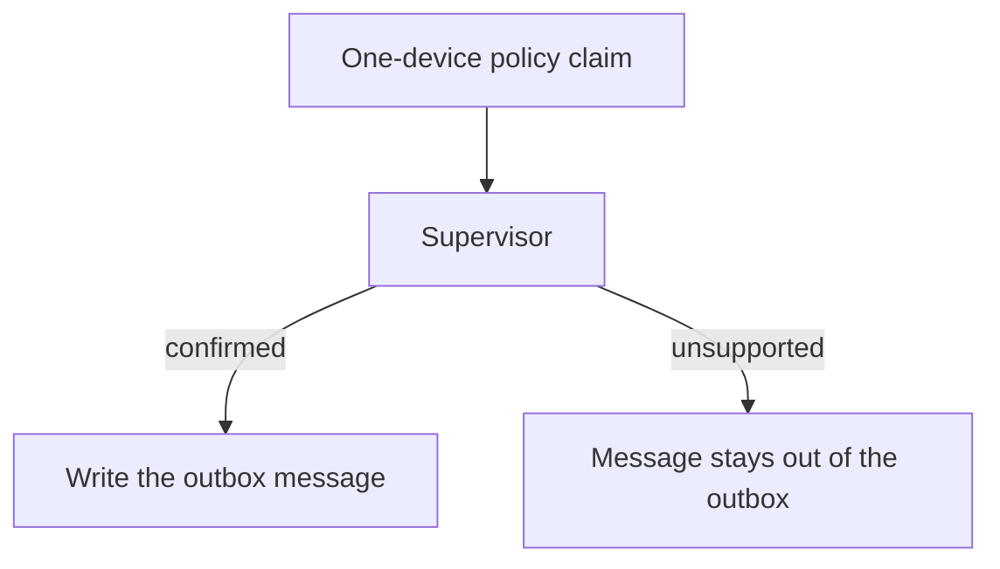

# Checking a policy claim before sending

This example represents a support assistant that is preparing a customer
message. The assistant claims that each subscription allows only one device.
The supervisor cannot confirm that claim, so the message is stopped before it
reaches the outbox.



The outbox is only a sandbox directory. Nothing is sent by email or to a real
customer.

```bash
uv pip install -e .
python3 cases/false-policy/run.py
```

The example uses local files instead of SMTP or another delivery service.
