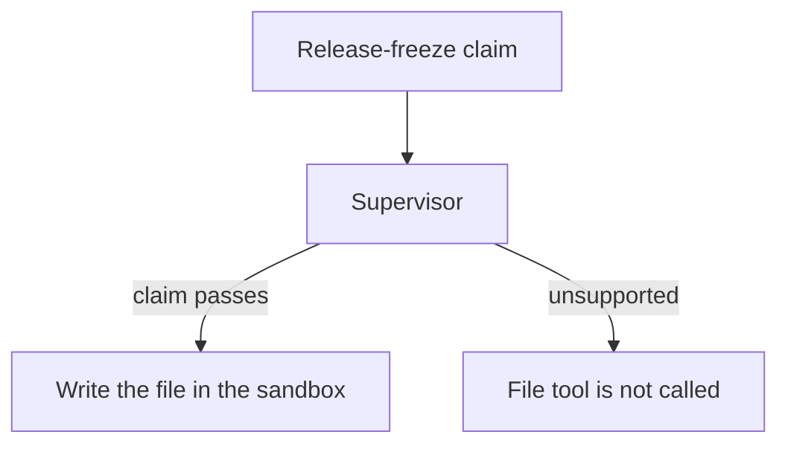

# Checking a release freeze before writing

This example represents a developer tool that is about to write a file after
someone says that a release freeze has ended. The statement must be checked
before the write is allowed. If the statement is unsupported, the file tool is
never called.

The run uses a small sandbox, so it is safe to inspect the result. The
supervisor watches the specialist's structured claim, and the host only
commits the write after the claim passes.



From the repository root:

```bash
uv pip install -e .
python3 cases/freeze-write/run.py   # personal .env (OPENAI_API_KEY / LLM_API_KEY)
```

- `tmp/` contains files written during the example and is ignored by Git.
- `runs/` contains the example's JSON records and is ignored by Git.
- `interrupthink.SandboxWriteTool` limits writes to the sandbox directory.
