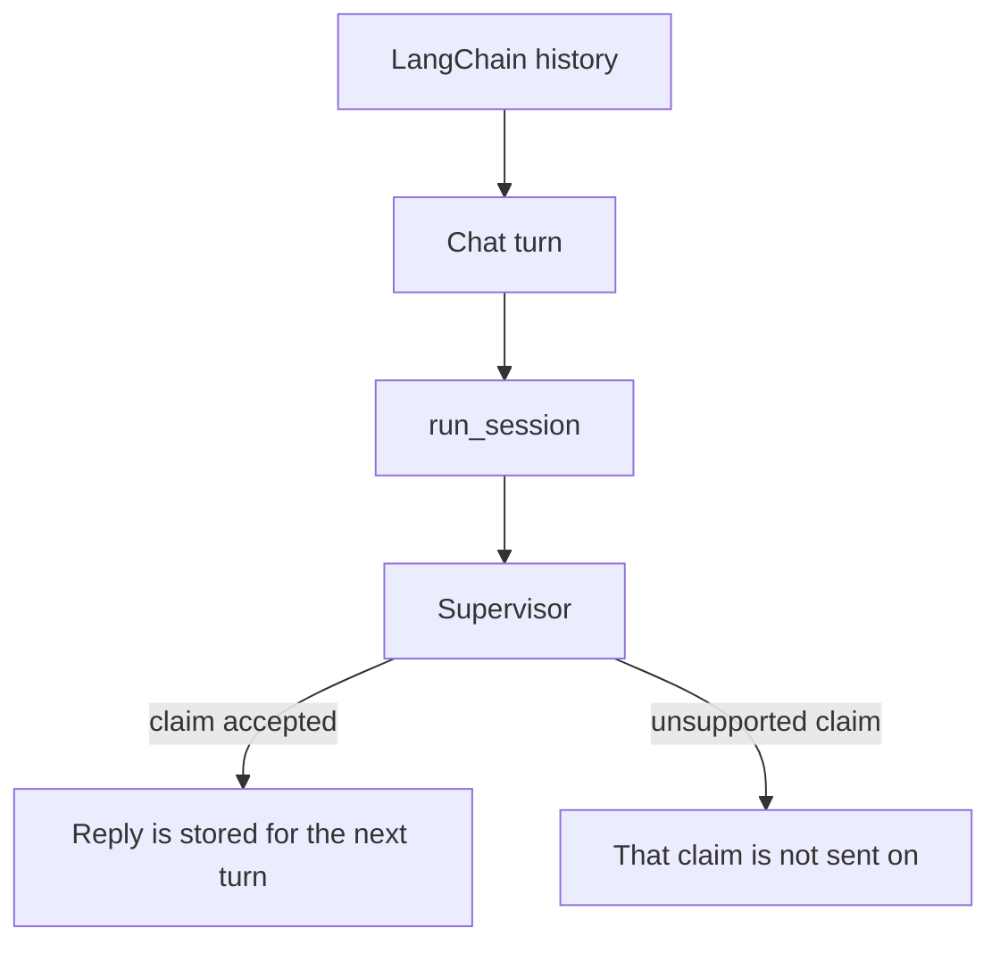

# Checking a claim during a LangChain conversation

This example contains two chat turns. LangChain keeps the conversation history
and formats the messages. Each turn calls `run_session`, which gives the
supervisor a chance to check a claim before the answer is sent to the next
step.

The example is a backend workflow, not a user interface and not a replacement
for LangChain's conversation features. A short version is available in
`examples/langchain_chat.py`.



```python
from chat import run_chat

payload = run_chat(interrupt=True, sandbox=Path("tmp"))
```

```bash
pip install langchain   # venv, not uv add
python3 cases/langchain-chat/run.py   # needs LLM_API_KEY / OPENAI_API_KEY
```
