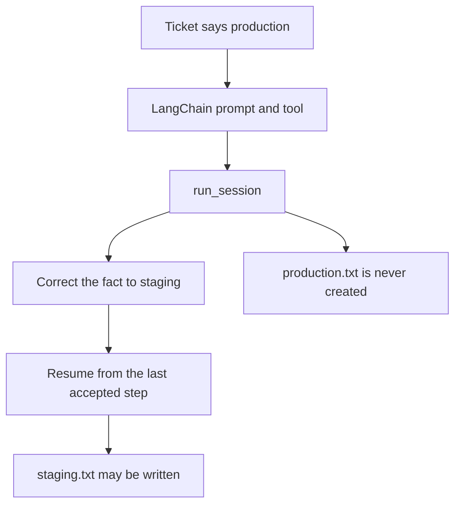

# Correct a wrong host claim in LangChain

This example uses a deployment ticket that incorrectly says the target host is
production. A LangChain wrapper supplies the prompt and tool, while
InterrupThink observes the specialist's structured steps.

When the production claim is detected, the supervisor supplies the corrected
staging fact. The session rolls back to the last accepted step and continues,
so `production.txt` is never created and `staging.txt` may be written.



The short version is available in `examples/langchain_correct.py`.

```python
from agents import create_specialist

specialist = create_specialist(interrupt=True, sandbox=Path("tmp"))
outcome = specialist.run()
```

```bash
pip install langchain   # venv, not uv add
python3 cases/langchain-correct/run.py   # needs LLM_API_KEY / OPENAI_API_KEY
```
