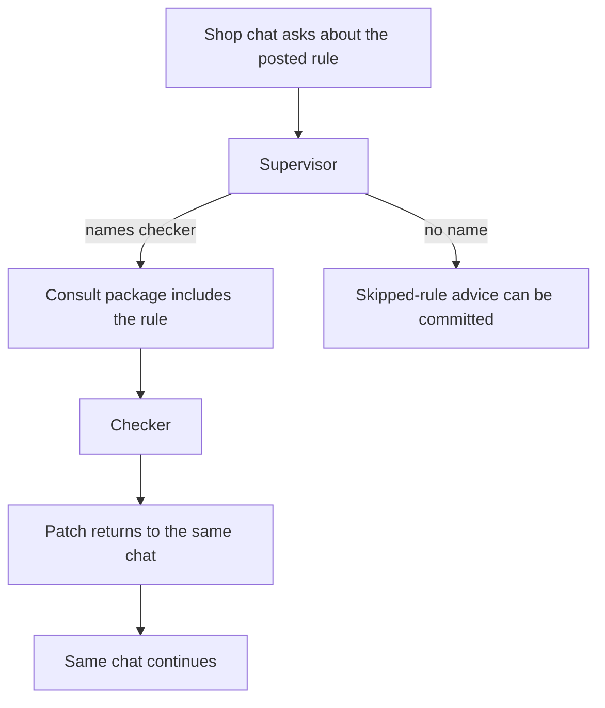

# Same chat after a rule check

A shop owner asks whether a posted city rule may be skipped. The checker
receives the rule package, and the patch returns to this same chat. The route
lives in this folder.



```bash
pip install langchain-core    # venv, not uv add
python3 cases/langchain-rule/run.py
```

Demo: `examples/langchain_rule_consult.py`.
