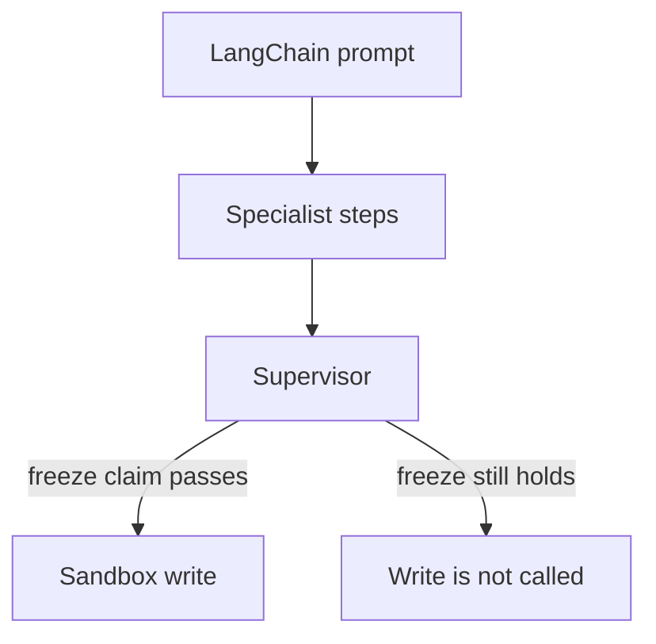

# Checking a release claim in a LangChain application

This example is a small developer workflow. A LangChain prompt asks a
specialist to decide whether a release-freeze condition allows a file write.
The specialist produces structured steps, while InterrupThink checks the claim
before the sandbox tool is called.

LangChain remains responsible for prompt and tool wiring. `run_session` remains
the semantic thinking boundary. The short version is available in
`examples/langchain_specialist.py`.



```python
from agents import create_specialist

specialist = create_specialist(interrupt=True, sandbox=Path("tmp"))
outcome = specialist.run()
```

```bash
pip install langchain   # venv, not uv add
python3 cases/langchain-specialist/run.py   # needs LLM_API_KEY / OPENAI_API_KEY
```
