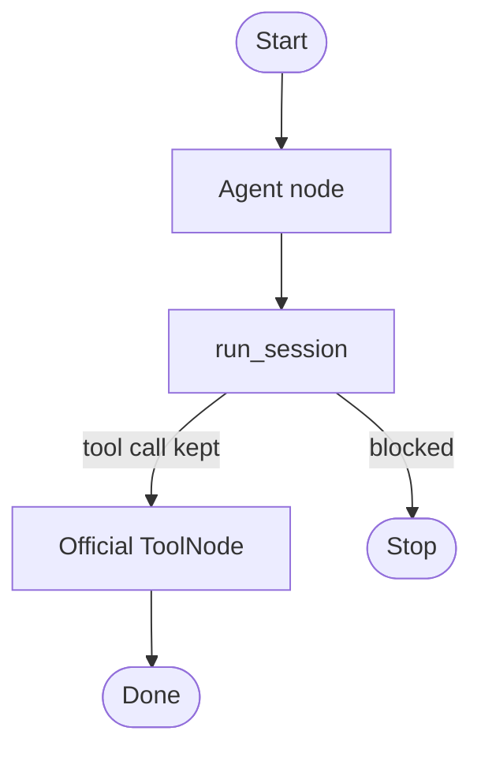

# Add the floor to an existing LangGraph application

This example shows a practical integration path. Keep the application's
existing graph, checkpointer, official `ToolNode`, and human approval at the
tool boundary. Replace only the model-producing node with `run_session`.

The semantic supervisor can stop or correct the model before it reaches the
tool. LangGraph's own tool boundary remains a second safety check. The example
does not require a separate InterrupThink plugin or a custom `ToolNode`.



```python
from graph import create_apply_graph

compiled, _ = create_apply_graph(interrupt=True, sandbox=Path("tmp"))
compiled.invoke({"messages": [], "blocked": False})
```

```bash
pip install langgraph langchain   # venv, not uv add
python3 cases/langgraph-apply/run.py
```

Demo: `examples/langgraph_apply.py`.
