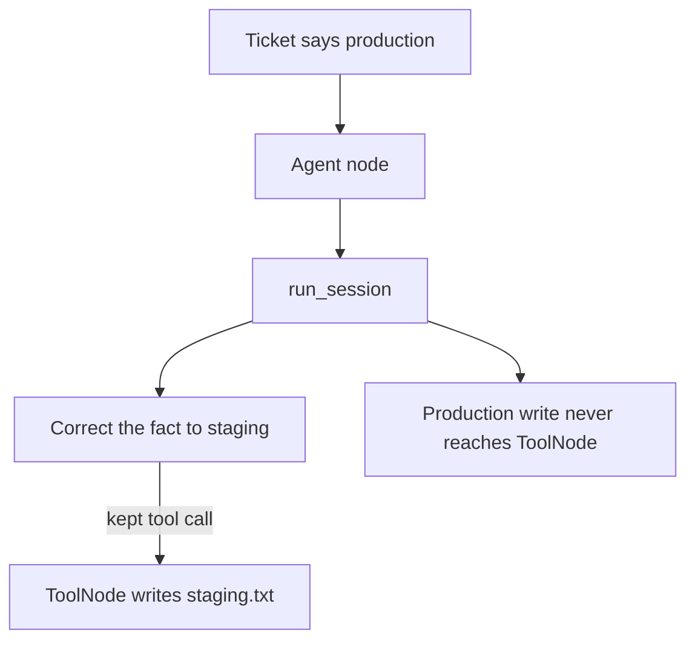

# Correct a fact and continue through LangGraph

This example uses a deployment ticket that incorrectly identifies the target
as production. The agent node calls `run_session`; when the supervisor catches
the mistake, it supplies the staging fact and the session resumes.

The graph then still visits its normal `ToolNode`, which writes `staging.txt`.
The invalid production write is never made. This shows how correction and
rollback can work without replacing LangGraph's normal tool boundary.



```python
from graph import create_correct_graph

compiled, _ = create_correct_graph(interrupt=True, sandbox=Path("tmp"))
compiled.invoke({"messages": [], "interrupted": False})
```

```bash
pip install langgraph langchain   # venv, not uv add
python3 cases/langgraph-correct/run.py
```

Demo: `examples/langgraph_correct.py`.
