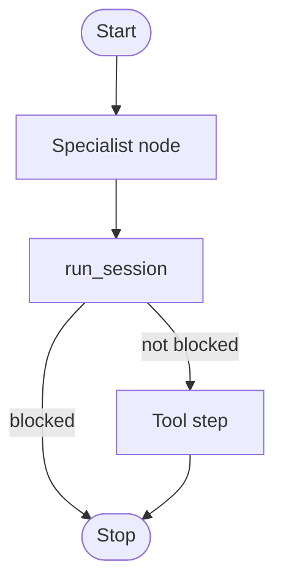

# Putting the thinking floor inside one LangGraph node

This example starts with an existing LangGraph application that has a
specialist node and a tool step. The specialist node calls `run_session`, so
the semantic check happens while the model is producing its structured work.
The graph's own tool or human-approval boundary remains a useful backup before
the external action.



This is a host integration example, not a separate InterrupThink framework
package. Install LangGraph in the virtual environment and try the short demo
in `examples/langgraph_specialist_node.py`.

```bash
pip install langgraph
python3 cases/langgraph-node/run.py
```
