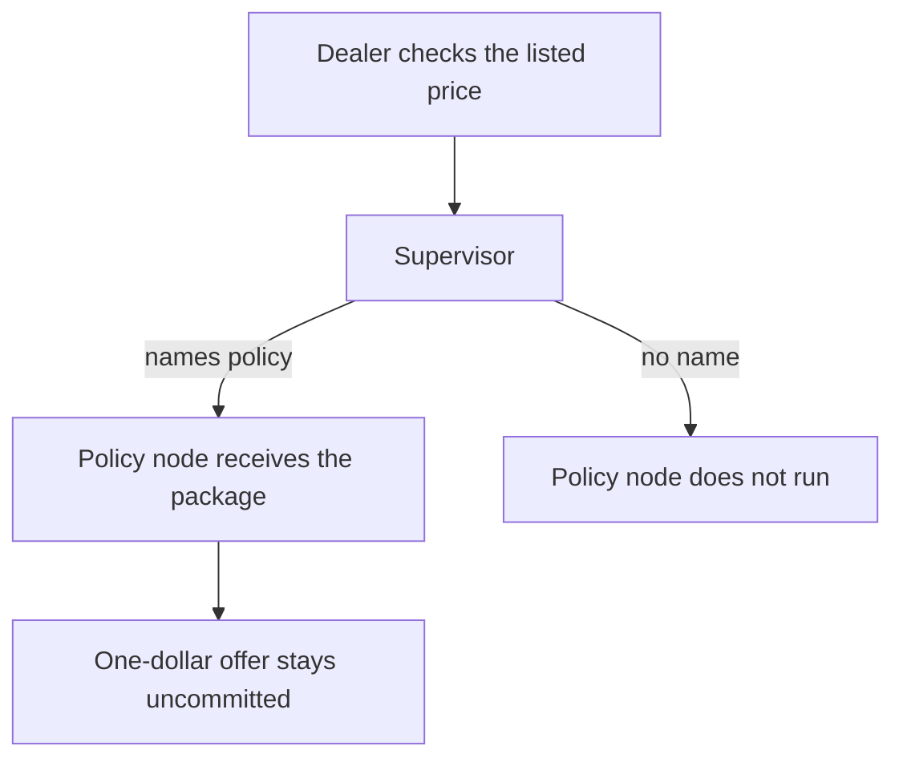

# Offer package through two LangGraph nodes

The dealer node checks a listed price. The supervisor names policy before a
one-dollar offer is committed. The policy node receives that package. The
route lives in this folder, with the price fixture, a sandbox copy of the
package, and a run command.



```bash
pip install langgraph    # venv, not uv add
python3 cases/langgraph-offer/run.py
```

Demo: `examples/langgraph_offer_escalation.py`.
