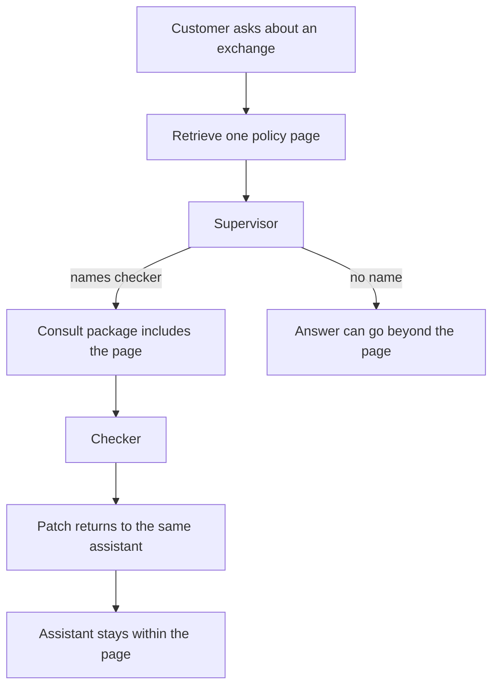

# Same assistant after a retrieved page

A customer asks about an exchange. The checker receives the retrieved page,
and the same assistant continues only as far as that page. The index does not
run the chat. The route lives in this folder.



```bash
pip install llama-index    # venv, not uv add
python3 cases/llamaindex-page/run.py
```

Demo: `examples/llamaindex_page_consult.py`.
