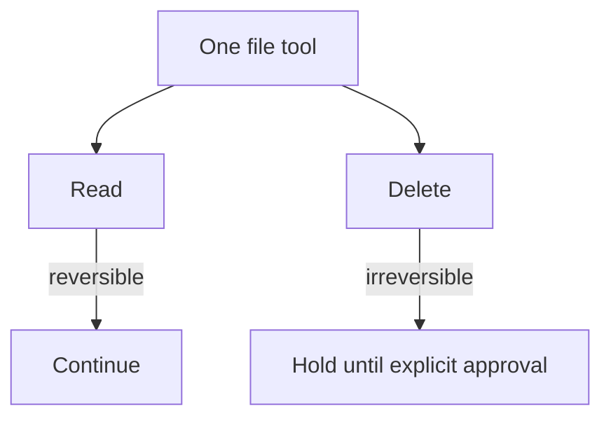

# Treating risky operations differently

This example uses one file tool for two operations. Reading a file is
reversible and can continue normally. Deleting a file is irreversible, so the
operation is held until it receives an explicit approval.

The decision is based on the operation's safety metadata, not on the tool's
name. This is useful when several tools can perform actions with different
levels of risk.



```bash
uv pip install -e .
python3 cases/op-class/run.py
```

All operations are limited to the local sandbox. Nothing outside it can be
deleted.
