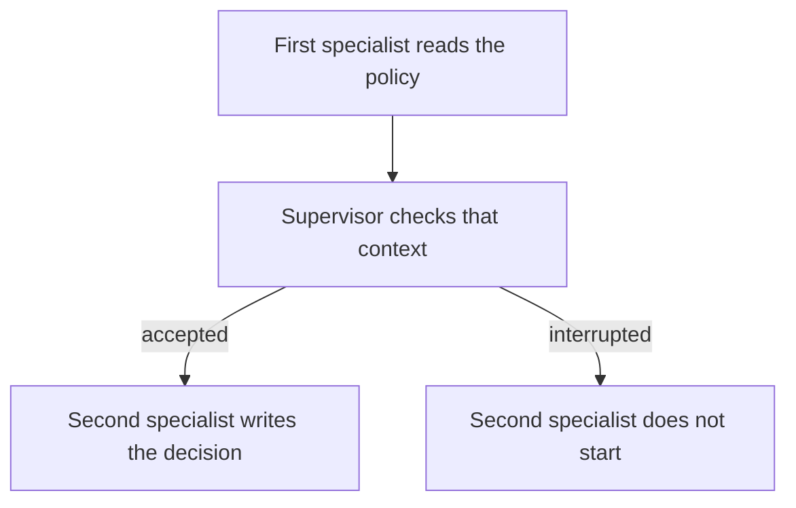

# Reviewing information before a decision

This example models a small workflow with two specialists. The first reads a
refund-policy document and prepares useful context. A supervisor checks that
context. Only when it is accepted does the second specialist turn it into a
decision file in the sandbox.

The example demonstrates a one-way handoff: the second specialist does not
start if the first specialist is interrupted. This keeps an unsafe or stale
piece of information from reaching the next action.



From the repository root:

```bash
uv pip install -e .
python3 cases/two-specialists/run.py
```

- `fixtures/policy/` contains current and stale policy documents.
- `tmp/` contains the sandbox decision file and is ignored by Git.
- `runs/` contains JSON records and is ignored by Git.
- The first specialist reads the fixture; the second uses
  `interrupthink.SandboxWriteTool` to create the decision.
