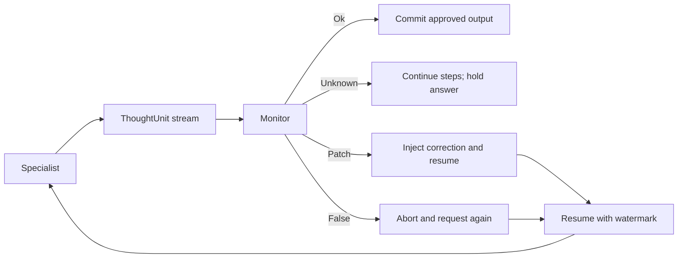

# Concepts

[English](concepts.md) · [Bahasa Indonesia](id/concepts.md)

## The 1:1 thinking floor

InterrupThink separates the thinking loop from the host application. A
specialist produces a structured document; a monitor observes semantic steps;
the floor decides whether a tool call or answer can be committed.

The host may be a plain Python function or a framework graph. The host does
not replace the floor: each specialist slot still calls `run_session`.

## ThoughtUnit boundaries

The interrupt boundary is a semantic `ThoughtUnit`, represented by a `<step>`
in the current XML document. Typical step kinds include:

- `plan` — an intended sequence;
- `premise` — a condition the plan depends on;
- `claim` — an assertion that can be checked;
- `tool_intent` — a proposed tool call and its reversibility.

This is not a raw-token cancellation protocol. The floor waits for a
checkable unit, records the unit, and then applies the monitor verdict.
A live `LlmMonitor` call is a blocking HTTP request for that unit.
Only askable kinds (`premise`, `claim`, `tool_intent`, and `answer_draft`) make that call, and exhausting `max_requests` without a committed answer raises `SessionError`, a legitimate result when the session does not finish.
Specialist generation does not continue in the background while the
supervisor answers. The live specialist Responses request streams in the
foreground (`background` is false). An interrupt closes that stream and
then POSTs cancel. Mock tests lock that request mode; a successful cancel
HTTP response is not proof the provider stopped generating.

## Monitor verdicts

The supervisor monitor returns a small verdict vocabulary:

- `Unknown` — insufficient evidence; do not interrupt by default, and do not
  commit a final answer without `Ok`;
- `Ok` — the current path can continue;
- `Patch` — interrupt **and correct**: supply missing or replacement facts,
  then continue;
- `False` — interrupt because the path is unsupported or unsafe (block a
  tool or answer; resume may still carry a directive).
  If that `False` has no rollback watermark and no ingested unit, the
  session holds: it does not commit and does not start a resume request.
  The trace records `answer.rejected`.

The neutral default matters. A missing or malformed supervisor response must
not become an aggressive interruption. The current parser maps malformed or
unknown supervisor states to `Unknown`.

## Interrupt, correction, and rollback

The floor is not a cancel-only switch. Two outcomes matter:

1. **Block** — do not execute the unsafe tool or commit the unsupported
   answer.
2. **Correct** — drop the rejected tail, attach a `Patch` (missing facts and
   a directive), and ask the specialist again from the last accepted `ThoughtUnit`.

An interrupt aborts the current request. Resume is a **new request** carrying a
watermarked prefix and, when available, a patch. That is context replay, not a
rewind of provider model state. The specialist must implement `apply_resume`;
a generate-only model cannot silently skip the envelope. The default resume
mode is `rollback`: continue the reasoning process mid-stream rather than
restarting the entire task from scratch.

The result exposes enough information for a host to inspect the outcome,
including committed output, interrupt identifiers, dropped units, request
count, and tool calls.

## Tool safety

Tools are not executed merely because the model emitted a
`tool_intent`. The floor and host must permit the intent first.
`run_session(..., tool_policy=None)` is allow-if-Ok: after an `Ok` verdict the
supplied tool runs. That default is for demos and OSS examples, not production
authorization. Hosts must pass `tool_policy(name, args)` for consequential
tools. Returning `False` skips execute even when the model labeled the intent
reversible. Model `reversible` is intent only.

Three checks, in this order:

1. The monitor verdict on the `ThoughtUnit`.
2. The host `tool_policy(name, args)`. An `Ok` verdict and
   `reversible="true"` do not authorize a name the host refuses.
   [`examples/tool_policy_deny.py`](../examples/tool_policy_deny.py) shows
   that with no API key: `publish` is denied and `save_draft` still runs.
3. A person at the tool boundary, when the host adds that gate. It does not
   replace the monitor or the host policy.

The current examples exercise:

- an irreversible tool that must not run after a false premise;
- a sandbox writer that rejects paths outside its root;
- a downstream writer that is never started when an upstream specialist is
  interrupted.

The examples use dummy tools or sandbox files. They do not control a real
database, Git repository, email system, or deployment.

## Visible reasoning boundary

The protocol uses checkable task steps as an application communication
surface. It is not a mechanism for transporting hidden chain-of-thought.
Applications should emit only the structured information needed for checking,
coordination, and the final answer.
