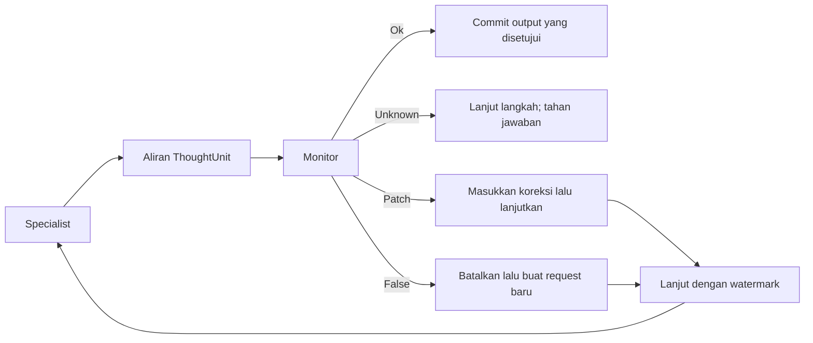
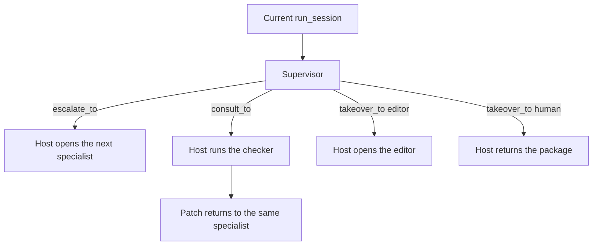

# Konsep

[English](../concepts.md) · [Bahasa Indonesia](concepts.md)

## Thinking floor 1:1

InterrupThink memisahkan siklus penalaran dari aplikasi host. Specialist
menghasilkan dokumen terstruktur, monitor mengamati langkah semantik, dan
thinking floor menentukan apakah tool atau jawaban boleh di-commit.

Host dapat berupa fungsi Python biasa atau graph framework. Host tidak
menggantikan floor; setiap slot specialist tetap memanggil `run_session`.

## Batas ThoughtUnit

Batas interupsi adalah `ThoughtUnit`, direpresentasikan oleh `<step>` pada
dokumen XML saat ini. Jenis langkah yang umum mencakup:

- `plan` — urutan kerja yang direncanakan;
- `premise` — kondisi yang menjadi dasar rencana;
- `claim` — pernyataan yang dapat diperiksa;
- `tool_intent` — usulan pemanggilan tool dan sifat reversibilitasnya.

Ini bukan protokol pembatalan pada setiap token mentah. Floor menunggu unit
yang bisa diperiksa, mencatatnya, lalu menerapkan verdict monitor. `LlmMonitor`
live mengirim HTTP request blocking untuk unit tersebut. Hanya jenis askable
(`premise`, `claim`, `tool_intent`, dan `answer_draft`) yang melakukan request
itu, dan `max_requests` yang habis tanpa jawaban di-commit menimbulkan
`SessionError`, hasil yang valid ketika sesi tidak selesai.
Specialist tidak terus melakukan generate di latar belakang saat supervisor
menjawab. Request Responses specialist live melakukan streaming di foreground
(`background` adalah false). Interupsi menutup stream tersebut lalu melakukan
POST cancel. Test mock mengunci mode request itu; respons HTTP cancel yang
berhasil bukan bukti bahwa provider telah menghentikan generate.

## Verdict monitor

- `Unknown` — bukti belum cukup; default-nya tidak menginterupsi, dan tidak
  commit jawaban akhir tanpa `Ok`;
- `Ok` — jalur saat ini boleh dilanjutkan;
- `Patch` — interupsi sekaligus koreksi dengan fakta atau arahan tambahan;
- `False` — jalur tidak didukung atau tidak aman sehingga diblokir.
  Jika `False` itu tidak punya watermark rollback dan tidak ada unit yang
  di-ingest, sesi menahan: tidak commit dan tidak memulai request resume.
  Jejak mencatat `answer.rejected`.

Default netral ini penting. Respons supervisor yang hilang atau malformed tidak
boleh otomatis menjadi interupsi agresif. Parser saat ini memetakan state
supervisor yang malformed atau tidak dikenal menjadi `Unknown`.

## Interupsi, koreksi, dan rollback

Floor bukan sekadar tombol cancel:

1. **Block** — tool berbahaya atau jawaban yang tidak didukung tidak dijalankan.
2. **Correct** — bagian yang ditolak dibuang, `Patch` ditempelkan, lalu
   specialist diminta melanjutkan dari `ThoughtUnit` terakhir yang diterima.

Interupsi membatalkan request aktif. Resume adalah request baru yang membawa
prefix dengan watermark dan, jika tersedia, patch. Ini adalah context replay,
bukan rewind state model provider. Specialist harus mengimplementasikan
`apply_resume`; model yang hanya bisa generate tidak dapat diam-diam melewati
envelope. Mode resume default adalah `rollback`: lanjutkan proses penalaran di
tengah aliran, bukan restart seluruh tugas dari awal.

Hasil sesi menyediakan cukup informasi agar host dapat memeriksa outcome,
termasuk output yang di-commit, identifier interupsi, unit yang dibuang, jumlah
request, dan pemanggilan tool.

## Handoff bernama

Monitor dapat mengakhiri specialist saat ini walau verdict tetap `Ok`. Verdict
tersebut menyebut satu penerima:

- `escalate_to` — specialist lain seharusnya menyelesaikan tugas;
- `consult_to` — checker seharusnya menjawab, lalu jawabannya kembali kepada
  specialist yang sama;
- `takeover_to` — owner seharusnya menerima tugas.

`Unknown` tidak membuka rute. Nama kosong tidak membuka rute. Jika verdict
membawa lebih dari satu nama, sesi memakai escalation, lalu consultation, lalu
takeover.

Specialist saat ini berhenti. Jawaban yang belum di-commit tidak di-commit.
Prefix langkah yang dipertahankan tidak mencakup langkah yang dibuang atau
jawaban yang belum di-commit. Host membaca `escalate_to`, `consult_to`, atau
`takeover_to` pada hasil sesi dan memutuskan apakah sesi berikutnya akan
dimulai.

`Escalation`, `Consult`, dan `Takeover` menyusun teks yang dibaca penerima.
Ketiganya tidak memanggil `run_session`. Ketiga object ini menggunakan satu
bentuk paket yang sama:

- tugas asli;
- nama penerima (`role`);
- alasan supervisor;
- prefix langkah yang dipertahankan;
- baris `result {name}: {result}` untuk setiap pemanggilan tool yang mencatat hasil;
- baris penutup yang menyebut pemanggilan tool yang tidak boleh diulang.

`from_result(task, result)` membaca event floor yang cocok (`floor.escalate`,
`floor.consult`, atau `floor.takeover`). `from_note(task, note)` membaca note
yang sudah dimiliki host. `text()` mengembalikan paket.

### Escalation

`result.escalate_to` menyebut specialist berikutnya. Specialist pertama tidak
melanjutkan. Host memulai `run_session` baru untuk specialist tersebut dan
meneruskan `Escalation.from_result(task, result).text()` sebagai request baru.

Graph, crew, atau daftar agent tidak menentukan specialist. Host membuka sesi
berikutnya hanya ketika nama penerima ada.

Lihat [`examples/supervisor_escalation.py`](../../examples/supervisor_escalation.py)
dan [`cases/langgraph-offer/`](../../cases/langgraph-offer/).

### Consultation

`result.consult_to` menyebut checker. Host menjalankan checker tersebut dengan
`Consult.from_result(task, result).text()`. Jawaban checker yang sudah
di-commit kembali kepada specialist yang sama sebagai `Patch` pada
`run_session(..., resume_patch=...)` baru. Owner tugas tetap sama.

Riwayat chat yang sama, atau object assistant yang sama, melanjutkan dari
prefix yang dipertahankan ditambah patch. Checker tidak menjadi owner baru.

Lihat [`examples/supervisor_consult.py`](../../examples/supervisor_consult.py)
dan [`cases/langchain-rule/`](../../cases/langchain-rule/).

### Takeover

`result.takeover_to` menyebut owner.

`editor` adalah specialist lain. Host dapat membuka `run_session` kedua dengan
`Takeover.from_result(task, result).text()`. Specialist pertama tidak
melanjutkan.

`human` bukan specialist. Host mengembalikan teks paket yang sama. Specialist
kedua tidak dimulai, dan monitor tidak menulis balasan yang akan dilihat orang
tersebut.

Lihat [`examples/supervisor_takeover.py`](../../examples/supervisor_takeover.py)
dan [`cases/autogen-support/`](../../cases/autogen-support/).

## Keamanan tool

Tool tidak otomatis dijalankan hanya karena model menghasilkan
`tool_intent`. Floor dan host harus mengizinkan intent tersebut.
`run_session(..., tool_policy=None)` adalah allow-if-Ok: setelah verdict `Ok`,
tool yang diberikan dijalankan. Default tersebut untuk demo dan contoh OSS,
bukan otorisasi produksi. Host harus meneruskan `tool_policy(name, args)` untuk
tool yang berkonsekuensi. Mengembalikan `False` melewati execute bahkan jika
model memberi label intent sebagai reversible. `reversible` dari model hanya
menunjukkan intent.

Tiga pemeriksaan ini berlangsung berurutan:

1. Verdict monitor pada `ThoughtUnit`.
2. `tool_policy(name, args)` milik host. Verdict `Ok` dan
   `reversible="true"` tetap tidak dapat mengizinkan nama tool yang ditolak
   host.
   [`examples/tool_policy_deny.py`](../../examples/tool_policy_deny.py)
   menunjukkan alur ini tanpa API key: `publish` ditolak, sedangkan
   `save_draft` tetap dijalankan.
3. Manusia di batas tool, jika host menambahkan pemeriksaan itu. Pemeriksaan
   ini tidak menggantikan monitor atau kebijakan host.

Contoh saat ini mencakup:

- tool yang tidak dapat dibatalkan dan tidak boleh berjalan setelah premise
  yang salah;
- penulis sandbox yang menolak path di luar root-nya;
- writer downstream yang tidak pernah dimulai ketika specialist upstream
  diinterupsi.

Contoh hanya menggunakan dummy tool dan file sandbox. Tidak ada database, Git,
email, atau sistem deployment yang dikendalikan oleh contoh ini.

## Batas penalaran yang terlihat

Protokol memakai langkah tugas yang dapat diperiksa sebagai media komunikasi
aplikasi. Ini bukan mekanisme untuk mengirim hidden chain-of-thought.
Aplikasi sebaiknya hanya mengeluarkan informasi terstruktur yang dibutuhkan
untuk pemeriksaan, koordinasi, dan jawaban akhir.
