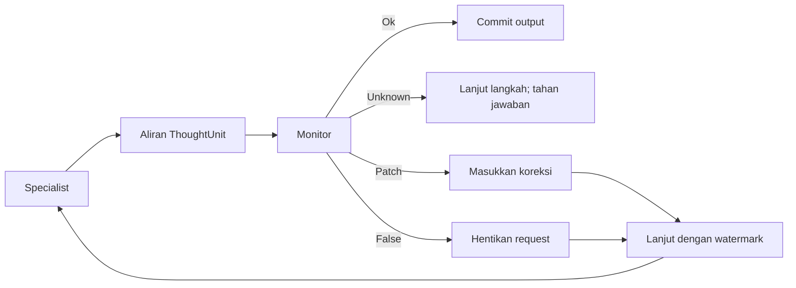

# Konsep

[English](../concepts.md) · [Bahasa Indonesia](concepts.md)

## Thinking floor

InterrupThink memisahkan siklus penalaran dari aplikasi host. Specialist
menghasilkan dokumen terstruktur, monitor mengamati langkah semantik, dan
thinking floor menentukan apakah tool atau jawaban boleh di-commit.

Host dapat berupa fungsi Python biasa atau graph framework. Host tidak
menggantikan floor; setiap giliran specialist tetap menggunakan `run_session`.

## Batas ThoughtUnit

Batas interupsi adalah `ThoughtUnit`, direpresentasikan oleh `<step>` pada
dokumen XML. Jenis langkah yang umum:

- `plan` — urutan kerja yang direncanakan;
- `premise` — kondisi yang menjadi dasar rencana;
- `claim` — pernyataan yang dapat diperiksa;
- `tool_intent` — usulan pemanggilan tool dan sifat reversibilitasnya.

Ini bukan protokol pembatalan per token mentah. Floor menunggu unit yang bisa
diperiksa, mencatatnya, lalu menerapkan verdict monitor. `LlmMonitor` live
melakukan permintaan HTTP secara blocking untuk unit itu. Specialist tidak
melanjutkan generate di latar belakang saat supervisor menjawab.
Permintaan specialist live menggunakan stream foreground (`background` false).
Interupsi menutup stream itu lalu mengirim POST cancel. Tes mock mengunci mode
permintaan; respons HTTP cancel yang sukses bukan bukti bahwa generate benar-
benar berhenti di provider.

## Verdict monitor

- `Unknown` — bukti belum cukup; default-nya tidak menginterupsi, dan tidak
  commit jawaban akhir tanpa `Ok`;
- `Ok` — jalur saat ini boleh dilanjutkan;
- `Patch` — interupsi sekaligus koreksi dengan fakta atau arahan tambahan;
- `False` — jalur tidak didukung atau tidak aman sehingga diblokir.
  Jika `False` itu tidak punya watermark rollback dan tidak ada unit yang
  di-ingest, sesi menahan: tidak commit dan tidak memulai request resume.
  Jejak mencatat `answer.rejected`.

Default netral ini penting. Respons supervisor yang hilang atau malformed tidak
boleh otomatis menjadi interupsi agresif.

## Interupsi, koreksi, dan rollback

Floor bukan sekadar tombol cancel:

1. **Block** — tool berbahaya atau jawaban yang tidak didukung tidak dijalankan.
2. **Correct** — bagian yang ditolak dibuang, `Patch` ditempelkan, lalu
   specialist diminta melanjutkan dari `ThoughtUnit` terakhir yang diterima.

Interupsi membatalkan request aktif. Resume adalah request baru yang membawa
prefix dengan watermark dan, jika tersedia, patch. Mode default `rollback`
melanjutkan proses dari titik terakhir yang diterima, bukan mengulang seluruh
tugas.

## Keamanan tool

Tool tidak otomatis dijalankan hanya karena model menghasilkan
`tool_intent`. Floor dan host harus mengizinkan intent tersebut.
`run_session` menerima `tool_policy(name, args)` opsional. Mengosongkannya
(`tool_policy=None`) adalah allow-if-Ok: setelah verdict `Ok`, tool yang
diberikan dijalankan. Default itu untuk demo dan contoh OSS, bukan
otorisasi produksi. Host yang memanggil tool berkonsekuensi wajib mengirim
policy eksplisit. `reversible` dari model hanya intent; `Ok` monitor bukan
sistem otorisasi.

Contoh yang tersedia mencakup tool irreversible, penulis sandbox, dan writer
downstream yang tidak dijalankan ketika specialist upstream diinterupsi.

Contoh hanya memakai dummy tool dan file sandbox. Tidak ada database, Git,
email, atau deployment yang dikendalikan oleh contoh ini.

## Batas penalaran yang terlihat

Protokol memakai langkah tugas yang dapat diperiksa sebagai media komunikasi
aplikasi. Ini bukan mekanisme untuk mengirim hidden chain-of-thought.
Aplikasi sebaiknya hanya mengeluarkan informasi terstruktur yang dibutuhkan
untuk pemeriksaan, koordinasi, dan jawaban akhir.
